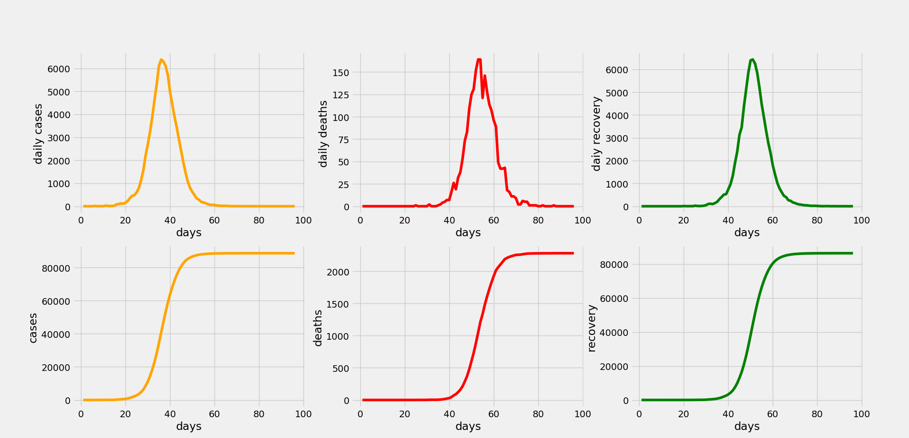

# Coronavirus-spread-simulation:
This program simulates the spread of a virus in a society. The society is an oriented object set of class and every individual have random connections and permanent connections.
# Here is an output example:

# All you need to use this simulation is:
python3 and install matplotlib
if u don't know how to install a module it's simple use the command
```
pip install matplotlib
```
